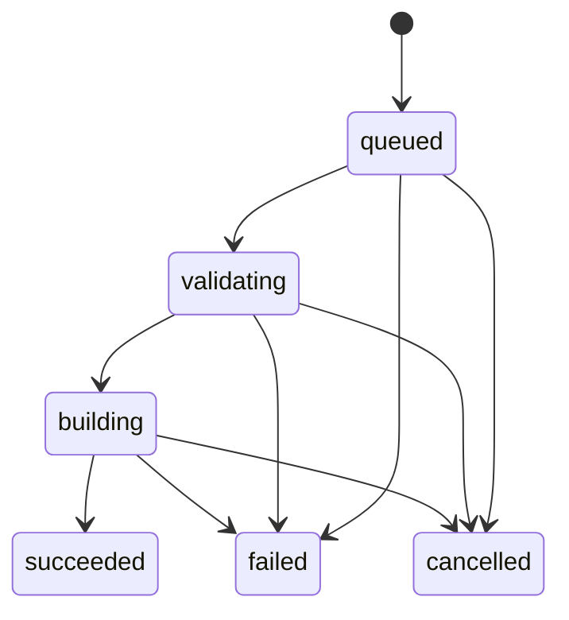
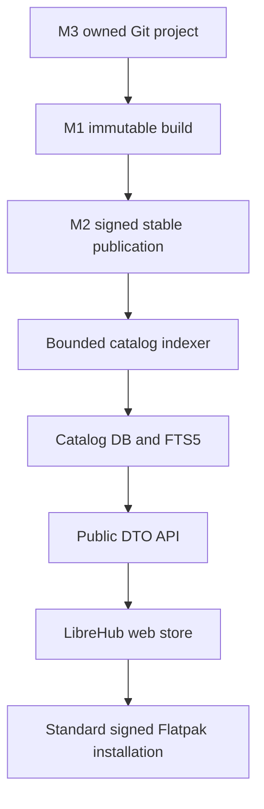
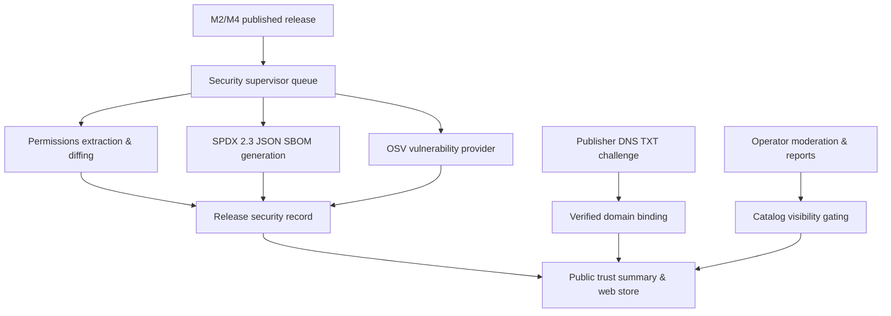

# LibreHub architecture

The workspace has seven Rust crates. `common` owns serializable domain types,
including UUID-backed IDs, architectures, UTC timestamps, manifests, state
transitions, structured validation/build errors, logs and artifacts. Extensible
Flatpak options remain JSON values at the manifest boundary; job state and service
communication use typed structures.

`validator` parses JSON or YAML into the same manifest model and applies an
extensible M1 policy. It requires core fields and inline module definitions,
validates identifiers/source definitions, and rejects unsafe destinations,
local includes, build-args, and unsupported runtime/extension features.

`builder` exposes async `BuildExecutor` and `LogSink` traits. The Docker executor
runs a trusted CLI with argument arrays, starts an unprivileged container with no
host mounts, copies in the normalized manifest, captures both streams, and returns
metadata for one safely extracted bundle. A remote/VM executor can replace it
without changing HTTP handlers. Executors must cooperate with cancellation and
return only after environment teardown; `cleanup` recovers abandoned containers.

`api` is an Axum server and asynchronous job supervisor in one service. SQLite is
the durable queue; one active worker polls queued records and receives wakeups after
submission. This avoids a second queue transaction and lost in-memory jobs. The
API never waits for a build. Database operations use Tokio's blocking pool with a
serialized connection, WAL mode and FULL synchronous writes. The `Store` module
hides SQL, allowing a future PostgreSQL repository and transactional job claims.

The SQLite schema keeps typed records and normalized manifest JSON, indexed
status columns and sequential log rows. Artifact files live under UUID directories.
An exclusive filesystem lock prevents two supervisors from using the same data
directory. M1 supports a single service instance on a local filesystem, not NFS or
horizontal scaling. There is no distributed queue or separately deployed validator.

Allowed transitions:

Terminal states cannot transition. Cancel requests are transactional and durable;
queued cancellation is immediate. For active jobs, the worker polls every 200 ms,
signals a cancellation token, and records cancellation after teardown. A final
transaction checks for cancellation again to handle completion races. Cleanup
failure is a build infrastructure error, not a claimed successful cancellation. It
stops the supervisor to avoid launching new work alongside an unverified container;
startup retries cleanup for these failed jobs before resuming the queue.

SIGINT/SIGTERM stops HTTP admission and cancels the active executor, waits for
teardown, and leaves queued jobs durable. Startup cleans interrupted containers,
marks validating/building jobs failed with `worker_restarted`, deletes private
scratch workspaces, and resumes queued jobs. Cleanup failures stop startup to avoid
starting work alongside an unverified abandoned container. Build failures and
executor panics are isolated; a storage/supervisor failure shuts down the service.

## M2 publishing boundary

`services/publisher` owns the async `Publisher` and `PublishJournal` abstractions,
artifact integrity/import checks, the flat-manager HTTP client and public signed
repository verification. Axum handlers never issue raw manager requests. Shared
publication IDs/channels/ref/state/result/signing types live in `common`. The API's
second supervisor uses the same SQLite connection/data ownership lock and a separate
bounded durable publication queue. It journals progress before remote side effects
and resumes interrupted stages against the backend's observed state.

Stable/beta select independent repositories; manifest branch selects the Flatpak
ref. Same application/channel/architecture releases are serialized, including
uncertain older releases. Concurrency is configurable for independent work. Builds
remain isolated containers, without publisher credentials or signing keys.
flat-manager owns PostgreSQL, staged uploads, commit rewriting, signing and summary
updates. nginx serves its generated repository as static HTTP content. The API and
publisher hold a scoped token/public key; only flat-manager holds private keys.

See [publishing.md](publishing.md) for state/idempotency/recovery and
[repository.md](repository.md) for signing, storage and future CDN deployment.

## M3 developer and source boundary

The API now adds a central bearer auth/authorization boundary, owner-scoped project
and audit/token handlers, and a third durable SQLite supervisor for source events.
`services/source` implements SourceProvider using credential-free HTTPS smart Git
through a pinned origin relay, a fresh restricted bare Git process, bounded
manifest discovery and regular-file snapshots. Source events persist exact SHA and
admitted policy. One transaction inserts the M1 build, ownership/provenance and
webhook completion, preventing duplicate handoff after a crash. The executor
rehashes the snapshot and copies safe source files into its existing container.
M2 owns every publication and signing action; auto-publication is just guarded,
journaled admission to its existing queue. See developer-platform.md for policy
race/recovery semantics and source-integration.md for the fetch trust boundary.

Untrusted developer requests → authenticated ownership/admission; unverified
webhook bytes → HMAC verification; untrusted Git → trusted restricted resolver;
untrusted snapshot → validator/hash/type/path checks → untrusted builder; untrusted
bundle → trusted M2 artifact verifier/publisher → trusted flat-manager signing
boundary. Secrets cross none of the Git/snapshot/builder/public repository edges.

## M4 catalog and browser boundary

`services/catalog` owns public models, CatalogStorage abstraction, bounded
AppStream/desktop extraction, normalization, URL classification and signed deployed
permission extraction. The API's fourth supervisor polls the durable successful
publication backlog into a capped SQLite catalog queue. Migration 004 adds app,
release, category, job and search state without changing M1/M2/M3 records. Public
routes are merged outside the private auth middleware and never serialize internal
platform records. The web application uses only that versioned public API.

Untrusted AppStream/Git project metadata, screenshots and descriptions → trusted
bounded normalization/indexer → atomic last-good catalog/search transaction →
explicit public DTOs → browser text escaping and validated links/assets. Signed
repository state and operator configuration are trusted; no request Host constructs
install/canonical URLs. Permissions come from the exact published signed checksum,
source presentation metadata from the verified built tree tied to its pre-rewrite
checksum. Catalog failure cannot roll back publication. See catalog.md, metadata.md,
store.md and m4-verification.md for resource, restart and browser boundaries.

## M5 trust, security and moderation boundary

`services/security` encapsulates security analysis and trust verification:
- **Permission diffing**: Compares Flatpak `[Context]` and finish-args against the previous stable release, categorizing additions/modifications into neutral severity tiers (`none`, `low`, `moderate`, `significant`).
- **SPDX 2.3 SBOM generator**: Produces canonical Software Bill of Materials documents cryptographically bound to publication ID, ref, commit hash, and OSTree checksum; stored under bounded filesystem paths (`data/security/<pub_id>/sbom.spdx.json`).
- **Publisher domain verification**: Cryptographically random challenge tokens verified via bounded UDP DNS TXT lookups against authoritative resolvers, strictly validating RFC 1035 / RFC 1123 domain syntax and defending against SSRF and DNS rebinding.
- **Vulnerability matching**: Asynchronous `VulnerabilityProvider` interface with OSV-compatible queries and deterministic test fixture support; upstream outages safely degrade to `analysis temporarily unavailable` rather than falsely claiming safety.

The API runs a fifth durable supervisor (`security_worker`) polling queued publications. Security job failures or external feed outages never roll back signed publications. The catalog and store layer dynamically injects `TrustSummary`, displays trust badges, warns of significant permission escalations, and gates delisted or removed applications.

See [trust.md](trust.md), [sbom.md](sbom.md), [vulnerability-analysis.md](vulnerability-analysis.md), [moderation.md](moderation.md), and [m5-verification.md](m5-verification.md).
