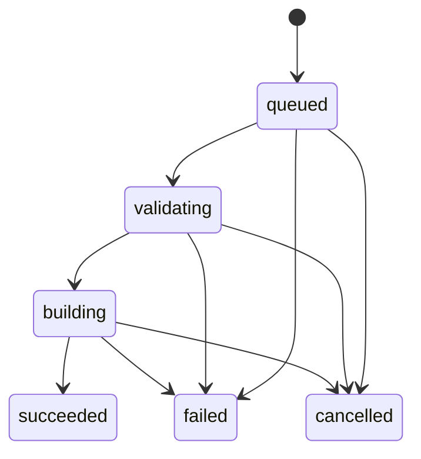

# M1 architecture

The workspace has four Rust crates. `common` owns serializable domain types,
including UUID-backed IDs, architectures, UTC timestamps, manifests, state
transitions, structured validation/build errors, logs and artifacts. Extensible
Flatpak options remain JSON values at the manifest boundary; job state and service
communication use typed structures.

`validator` parses JSON or YAML into the same manifest model and applies an
extensible M1 policy. It requires core fields and inline module definitions,
validates identifiers/source definitions, and rejects unsafe destinations,
local includes, build-args, and unsupported runtime/extension features.

`builder` exposes async `BuildExecutor` and `LogSink` traits. The Docker executor
runs a trusted CLI with argument arrays, starts an unprivileged container with no
host mounts, copies in the normalized manifest, captures both streams, and returns
metadata for one safely extracted bundle. A remote/VM executor can replace it
without changing HTTP handlers. Executors must cooperate with cancellation and
return only after environment teardown; `cleanup` recovers abandoned containers.

`api` is an Axum server and asynchronous job supervisor in one service. SQLite is
the durable queue; one active worker polls queued records and receives wakeups after
submission. This avoids a second queue transaction and lost in-memory jobs. The
API never waits for a build. Database operations use Tokio's blocking pool with a
serialized connection, WAL mode and FULL synchronous writes. The `Store` module
hides SQL, allowing a future PostgreSQL repository and transactional job claims.

The SQLite schema keeps typed records and normalized manifest JSON, indexed
status columns and sequential log rows. Artifact files live under UUID directories.
An exclusive filesystem lock prevents two supervisors from using the same data
directory. M1 supports a single service instance on a local filesystem, not NFS or
horizontal scaling. There is no distributed queue or separately deployed validator.

Allowed transitions:

Terminal states cannot transition. Cancel requests are transactional and durable;
queued cancellation is immediate. For active jobs, the worker polls every 200 ms,
signals a cancellation token, and records cancellation after teardown. A final
transaction checks for cancellation again to handle completion races. Cleanup
failure is a build infrastructure error, not a claimed successful cancellation. It
stops the supervisor to avoid launching new work alongside an unverified container;
startup retries cleanup for these failed jobs before resuming the queue.

SIGINT/SIGTERM stops HTTP admission and cancels the active executor, waits for
teardown, and leaves queued jobs durable. Startup cleans interrupted containers,
marks validating/building jobs failed with `worker_restarted`, deletes private
scratch workspaces, and resumes queued jobs. Cleanup failures stop startup to avoid
starting work alongside an unverified abandoned container. Build failures and
executor panics are isolated; a storage/supervisor failure shuts down the service.
