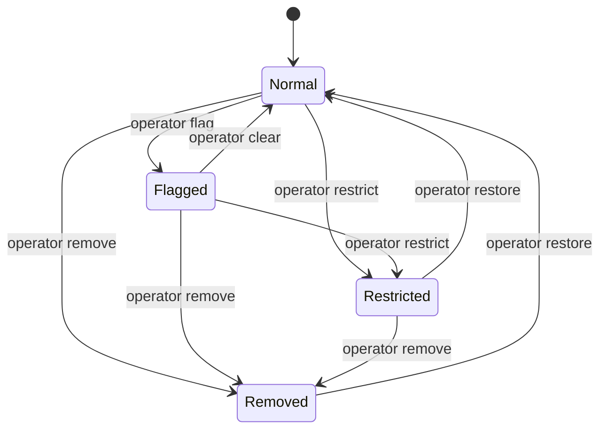

# Moderation, Abuse Reporting & Catalog Visibility Controls

LibreHub Milestone 5 establishes a formal moderation workflow, public abuse reporting pipeline, and catalog visibility gating system.

---

## 1. Moderation Principles

1. **Signals vs. Verdicts**: Abuse reports from users or automated scanners are *signals*, never autonomous verdicts. Under no circumstances does an accumulation of reports automatically restrict or remove an application without authorized operator evaluation.
2. **Auditability & Accountability**: All moderation actions, reasons, and state changes are recorded in an append-only moderation audit event log with operator identity, timestamp, and optional public/internal rationale.
3. **Forensic Integrity (No History Deletion)**: Moderation operates at the catalog visibility layer. Removing an application hides it from public discovery, catalog APIs, and web store frontends, but does **not** physically delete historical signed OSTree commits or cryptographic build attestations by default. This preserves forensic history and prevents breaking pinned systems while shutting down public distribution.

---

## 2. Moderation State Machine

Every application in the LibreHub catalog possesses an independent moderation record:



### State Definitions & Catalog Impact

| State | Catalog Search / Listing | Direct Web / API Route | Flatpak Installation | Trust State Equivalent |
|---|---|---|---|---|
| **Normal** | Visible in all categories and search queries | 200 OK with full details | Permitted | `unverified` or `verified_publisher` |
| **Flagged** | Visible in categories and search with a warning banner | 200 OK (with `flagged` status & public note) | Permitted | `unverified` or `verified_publisher` |
| **Restricted** | **Unlisted** (excluded from search and category listings) | 200 OK (with `restricted` status & public note) | Permitted via direct ref | `restricted` |
| **Removed** | **Hidden** (excluded from all search and listings) | **404 Not Found** | **Disabled** (ref revoked) | `removed` |

---

## 3. Abuse Reporting Pipeline

Users and security researchers can submit reports for any published application via the public web store or authenticated API.

### Public Endpoint
```http
POST /api/v1/catalog/apps/:app_id/reports
Content-Type: application/json

{
  "reason": "malware_phishing",
  "message": "Application attempts to harvest SSH keys from ~/.ssh",
  "reporter_email": "security@researcher.org"
}
```

### Report Reasons
- `security_issue`: Active exploit, insecure defaults, or dangerous dependency.
- `malware_phishing`: Destructive payload, keylogger, credential harvesting, or adware.
- `privacy_violation`: Unsolicited telemetry, spyware, or unauthorized tracking.
- `copyright_trademark`: DMCA / IP infringement, misleading branding or impersonation.
- `broken_malfunctioning`: Application fails to launch, corrupted binary, or crash loop.
- `other`: Detailed explanation in report message.

### Resolution Lifecycle
Each report transitions through a defined lifecycle managed by operators:
- `open`: Awaiting human review.
- `reviewed`: Investigated by security team; no immediate restriction warranted.
- `action_taken`: Moderation action applied to the application (flagged, restricted, or removed).
- `dismissed`: Invalid, spam, or unsubstantiated report.

---

## 4. Operator Tooling (`librehub-admin`)

LibreHub provides command-line tooling for administrative operators to triage reports and apply catalog controls.

### Listing Reports
```bash
# List all open reports
librehub-admin reports list --status open

# List all reports across all statuses
librehub-admin reports list
```

### Resolving Reports
```bash
librehub-admin reports resolve <report-id> action_taken \
  --resolution-note "App quarantined pending developer investigation"
```

### Applying Moderation Actions
```bash
# Flag an app with a public warning
librehub-admin catalog moderate org.librehub.SampleApp flag "Elevated vulnerability disclosure" \
  --public-note "Security team is investigating CVE-2026-1234 in bundled libcurl"

# Restrict an app (delist from catalog browse/search)
librehub-admin catalog moderate org.librehub.SampleApp restrict "Trademark dispute" \
  --internal-note "Awaiting clarification from upstream rights holder"

# Remove an app entirely
librehub-admin catalog moderate org.librehub.SampleApp remove "Malicious payload detected" \
  --public-note "Removed due to violation of platform security policies"

# Restore an app to normal status
librehub-admin catalog moderate org.librehub.SampleApp clear "Issue resolved by developer"
```
